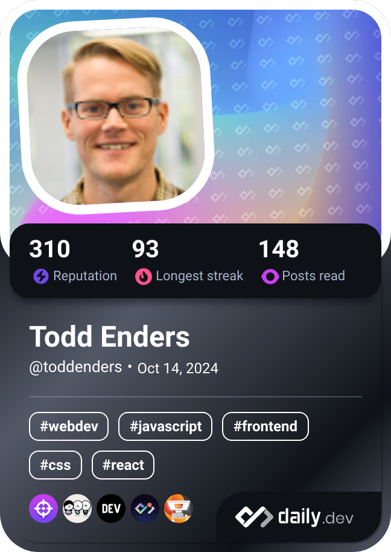

## Hi there 👋
- 🔭 I’m currently working at Gametime Hero on an app where anyone can start or connect with a community revolving around almost any common interest, such as sports, table games, watch parties, etc.
  -  I'm also revamping my [personal website](www.toddenders.com) 
- 🌱 I’m currently learning advanced React topics, and soon I will get into React Native to tap into mobile.
  -  I'm also knee deep in Leetcode's Data Structures and Algorithms Crash Course.
- 👯 I’m looking to collaborate on any Front End, Back End, or Full Stack applications. My strengths are Python, JS (React included), and Django.
- 📫 How to reach me: get at me on LinkedIn at tenders64
- 😄 Pronouns: He/Him
- ⚡ Fun fact: I'll tell you more than you want to hear about football and baseball strategies. I'm also a [KEXP](www.kexp.org) Amplifier. 

